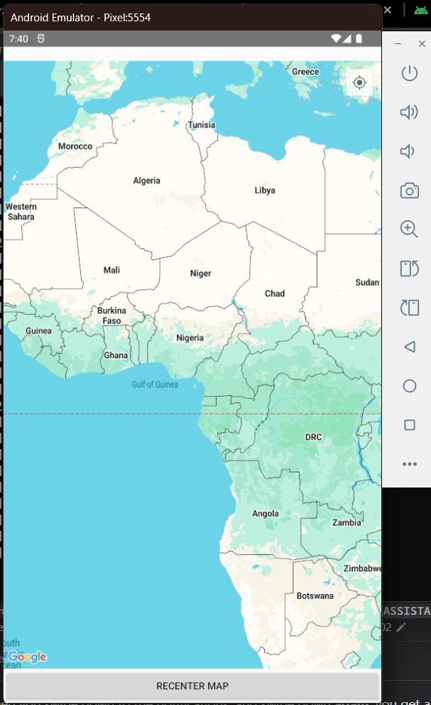

# android-lab-12
In this lab, we create an API key for Google Maps from the Google Cloud Developer Platform and use it in our app.

In the app, we:
* Display the map
* Display our current location
* Show nearby tourist locations
* Add markers to those locations

Once the API key is added correctly to the project,     
The map should load and display something like this:

